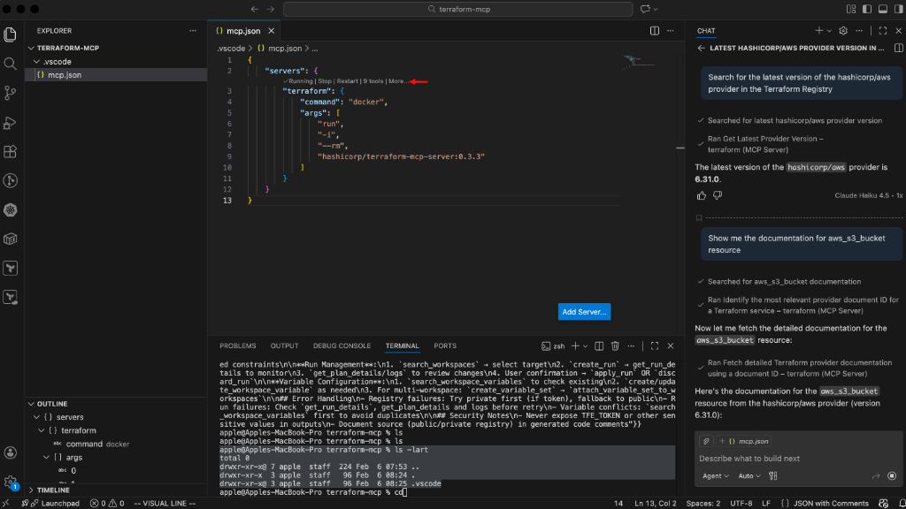

# Terraform MCP Server — Setup Guide (macOS + VS Code)

A step-by-step guide to integrate the **Terraform MCP Server** with **VS Code** on macOS for real-time Terraform Registry lookups powered by AI.

---

## What is Terraform MCP Server?

**MCP (Model Context Protocol)** is an open standard that allows AI assistants (like GitHub Copilot, Claude, etc.) to communicate with external tools and fetch live data during conversations.

The **Terraform MCP Server** (built by HashiCorp) connects your AI assistant directly to the **Terraform Registry** in real time.

### Without MCP (Old Way)

- You ask AI: _"What's the latest AWS provider version?"_
- AI answers from its training data — **could be outdated**
- You manually go to `registry.terraform.io` to verify

### With MCP (New Way)

- You ask AI the same question
- AI **queries the Terraform Registry live** via MCP
- Returns the **actual current version** (e.g., `6.31.0`)

### What It Can Do

| Feature                | Description                                                        |
| ---------------------- | ------------------------------------------------------------------ |
| Provider Lookup        | Search providers, get latest versions, view resource docs          |
| Module Search          | Find and inspect Terraform modules from the public registry        |
| Resource Documentation | Fetch real-time schema, arguments, and attributes for any resource |
| Policy Search          | Search Sentinel/OPA policy libraries                               |

> **Note:** This guide covers the **public Terraform Registry** only. No Terraform Cloud/Enterprise token is needed.

---

## Prerequisites

Before starting, make sure you have the following:

| Requirement                   | Minimum Version    | How to Check             |
| ----------------------------- | ------------------ | ------------------------ |
| macOS                         | Any recent version | —                        |
| Docker Desktop                | Latest             | `docker --version`       |
| VS Code                       | 1.99 or higher     | `code --version`         |
| GitHub Copilot Extension      | Latest             | Check VS Code Extensions |
| GitHub Copilot Chat Extension | Latest             | Check VS Code Extensions |

---

## Step-by-Step Setup

### Step 1: Install Docker Desktop

Docker is required because the Terraform MCP server runs inside a Docker container.

```bash
# Install using Homebrew
brew install --cask docker
```

After installation, **open Docker Desktop** from the Applications folder. Wait for the whale icon in the menu bar to stop animating (this means Docker is fully started).

**Verify Docker is running:**

```bash
docker --version
```

Expected output:

```
Docker version 27.x.x, build xxxxxxx
```

```bash
docker ps
```

Expected output: An empty table with headers (no error means Docker is running).

---

### Step 2: Pull the Terraform MCP Server Docker Image

```bash
docker pull hashicorp/terraform-mcp-server:0.3.3
```

**Verify the image was downloaded:**

```bash
docker images | grep terraform-mcp
```

Expected output:

```
hashicorp/terraform-mcp-server   0.3.3   e0c95281721a   18.2MB   5.16MB
```

---

### Step 3: Test the MCP Server Manually

Run this command to make sure the MCP server starts and responds correctly:

```bash
echo '{"jsonrpc":"2.0","id":1,"method":"initialize","params":{"protocolVersion":"2024-11-05","capabilities":{},"clientInfo":{"name":"test","version":"1.0"}}}' | docker run -i --rm hashicorp/terraform-mcp-server:0.3.3
```

**What to look for in the output:**

- ✅ `"serverInfo":{"name":"terraform-mcp-server","version":"0.3.3"}` — Server is working
- ⚠️ `"No Terraform token provided"` warning — This is **normal** for public registry usage, ignore it

If you see the JSON response with `serverInfo`, the MCP server is working correctly.

---

### Step 4: Install VS Code Extensions

Open VS Code and install these extensions:

1. Press `Cmd + Shift + X` to open the Extensions panel
2. Search for **"GitHub Copilot"** → Install it
3. Search for **"GitHub Copilot Chat"** → Install it
4. Sign in with your GitHub account when prompted

**Check your VS Code version:**

Go to **Code → About Visual Studio Code**. You need version **1.99 or higher** for MCP support.

If your VS Code is older:

```bash
brew install --cask visual-studio-code
```

---

### Step 5: Configure MCP in VS Code

There are two ways to add the MCP configuration. We recommend the **project-level approach** using `.vscode/mcp.json`.

#### Option A: Project-Level Config (Recommended)

This keeps the MCP config inside your project folder so it can be shared with teammates via Git.

Create the config file:

```bash
mkdir -p .vscode
touch .vscode/mcp.json
```

Open `.vscode/mcp.json` and paste this:

```json
{
  "servers": {
    "terraform": {
      "command": "docker",
      "args": ["run", "-i", "--rm", "hashicorp/terraform-mcp-server:0.3.3"]
    }
  }
}
```

> **Important:** In `.vscode/mcp.json`, you start directly with `"servers"`. There is no `"mcp"` wrapper.

#### Option B: User-Level Config (Global)

This applies the MCP config to all your VS Code projects.

Press `Cmd + Shift + P` → type **"Preferences: Open User Settings (JSON)"** → Enter.

Add the `"mcp"` block to your existing settings:

```json
{
  "your.existing.settings": "...",
  "mcp": {
    "servers": {
      "terraform": {
        "command": "docker",
        "args": ["run", "-i", "--rm", "hashicorp/terraform-mcp-server:0.3.3"]
      }
    }
  }
}
```

> **Important:** In `settings.json`, the config must be wrapped inside an `"mcp"` key.

Save the file with `Cmd + S`.

---

### Step 6: Verify the MCP Server is Running in VS Code

After saving the config:

1. Open the `.vscode/mcp.json` file (or the `settings.json` if you used Option B)
2. You should see a **▶ Running** indicator with **9 tools** above the server config
3. If you see `Start | Stop | Restart` options, click **Start**

If the server shows **Running** with tools available, you're connected.



---

### Step 7: Test with Copilot Agent Mode

1. Open **Copilot Chat** → Press `Cmd + Shift + I`
2. At the bottom of the chat panel, switch to **Agent** mode
3. Type a test prompt:

```
Search for the latest version of the hashicorp/aws provider in the Terraform Registry
```

**Expected behavior:**

- Copilot will call the MCP tool `Get Latest Provider Version`
- It will return the actual current version (e.g., **6.31.0**)
- This confirms real-time registry data is flowing through MCP

**More test prompts:**

```
Show me the documentation for aws_s3_bucket resource
```

```
Find Terraform modules for AWS VPC
```

```
What resources are available in the hashicorp/aws provider?
```

---

## How to Know It's Working vs Not Working

| Scenario              | What You See                                                                                        |
| --------------------- | --------------------------------------------------------------------------------------------------- |
| ✅ Working            | AI says "Ran Get Latest Provider Version — terraform (MCP Server)" and returns real version numbers |
| ❌ Docker not running | Error: "Cannot connect to the Docker daemon"                                                        |
| ❌ Image not pulled   | Error: "Unable to find image locally"                                                               |
| ❌ Wrong VS Code mode | No tools appear — switch from Chat to **Agent** mode                                                |
| ❌ Old VS Code        | No MCP support at all — update to version 1.99+                                                     |
| ❌ Invalid JSON       | Yellow squiggly lines in config file — check for missing commas or extra brackets                   |

---

## Quick Reference: All Commands

```bash
# 1. Install Docker Desktop
brew install --cask docker

# 2. Verify Docker
docker --version
docker ps

# 3. Pull the Terraform MCP Server image
docker pull hashicorp/terraform-mcp-server:0.3.3

# 4. Verify the image
docker images | grep terraform-mcp

# 5. Test the server manually
echo '{"jsonrpc":"2.0","id":1,"method":"initialize","params":{"protocolVersion":"2024-11-05","capabilities":{},"clientInfo":{"name":"test","version":"1.0"}}}' | docker run -i --rm hashicorp/terraform-mcp-server:0.3.3

# 6. Create project MCP config
mkdir -p .vscode
# Then add the JSON config to .vscode/mcp.json

# 7. Test in VS Code
# Open Copilot Chat → Switch to Agent mode → Ask a Terraform question
```

---

## Project File Structure

```
your-project/
├── .vscode/
│   └── mcp.json          ← MCP server configuration
├── main.tf               ← Your Terraform files
├── variables.tf
├── outputs.tf
└── README.md             ← This file
```

---

## Available MCP Tools (9 Tools)

Once connected, these tools are available to the AI assistant:

| Tool                       | Purpose                                               |
| -------------------------- | ----------------------------------------------------- |
| `getLatestProviderVersion` | Get the latest version of any Terraform provider      |
| `getProviderDetails`       | Fetch detailed info about a provider                  |
| `getProviderCapabilities`  | List available resources, data sources, and functions |
| `resolveProviderDocID`     | Find the document ID for a specific provider resource |
| `getProviderDocs`          | Fetch full documentation for a provider resource      |
| `searchModules`            | Search the Terraform module registry                  |
| `getModuleDetails`         | Get detailed info about a specific module             |
| `getLatestModuleVersion`   | Get the latest version of a module                    |
| `searchPolicies`           | Search Sentinel/OPA policy libraries                  |

---

## Useful Links

| Resource                      | URL                                                         |
| ----------------------------- | ----------------------------------------------------------- |
| Terraform MCP Server (GitHub) | https://github.com/hashicorp/terraform-mcp-server           |
| Terraform Registry            | https://registry.terraform.io                               |
| MCP Protocol Docs             | https://modelcontextprotocol.io/introduction                |
| VS Code MCP Documentation     | https://code.visualstudio.com/docs/copilot/chat/mcp-servers |
| Docker Desktop                | https://www.docker.com/products/docker-desktop              |

---

## Troubleshooting

### Docker daemon not running

```bash
# Open Docker Desktop from Applications, or:
open -a Docker
# Wait 30 seconds for it to start, then retry
```

### MCP server not showing in VS Code

- Make sure the JSON file has no syntax errors (no trailing commas, matching brackets)
- Restart VS Code after saving the config
- Check that Docker Desktop is running

### Copilot not showing Agent mode

- Update VS Code to version 1.99+
- Make sure GitHub Copilot and Copilot Chat extensions are installed and signed in
- Agent mode may need to be enabled in settings: `"github.copilot.chat.agent.enabled": true`

### Server shows "Running" but tools don't work

- Try clicking **Restart** on the MCP server status
- Check the OUTPUT panel in VS Code for error logs
- Make sure your internet connection is working (MCP queries the registry online)

---

## License

This guide is for personal/team reference. The Terraform MCP Server itself is licensed under [MPL-2.0](https://github.com/hashicorp/terraform-mcp-server/blob/main/LICENSE) by HashiCorp.
