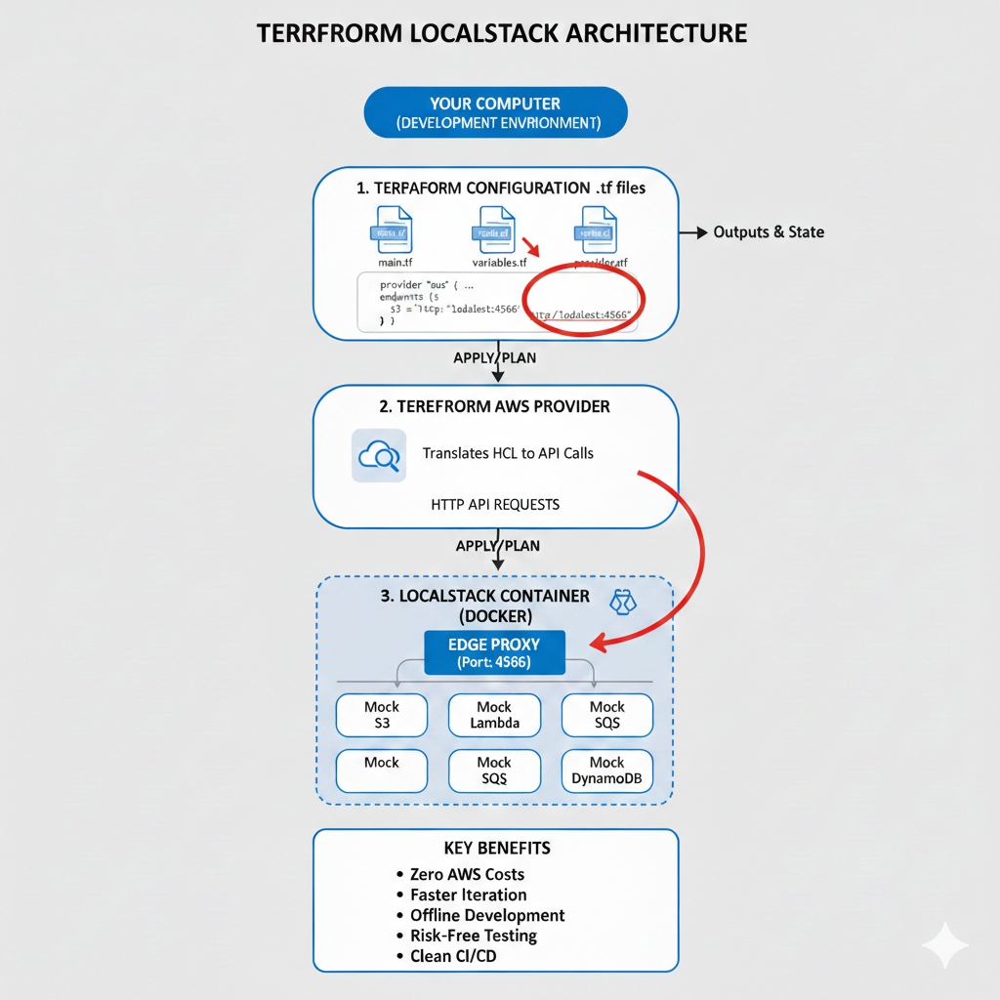

# Terraform Zero-to-Hero: Hands-on Labs

[](https://docs.localstack.cloud/aws/)

Welcome to the ultimate Terraform learning repository. This project provides a structured, hands-on curriculum to master Terraform Infrastructure as Code (IaC) **without incurring AWS costs**, thanks to **LocalStack**.

## 🎯 Purpose

- **Learn by Doing**: Over 20+ topics with runnable examples.
- **Zero Cost**: Uses LocalStack to simulate AWS services (S3, EC2, DynamoDB, IAM, etc.) locally on your laptop.
- **Best Practices**: Focuses on "The Right Way" (Modules, State Locking, Security, Declarative workflows).
- **Deep Dives**: Goes beyond basics into `dynamic` blocks, `lifecycle` rules, state surgery, and HCP Terraform.

---

## 🏗️ Architecture

How Terraform talks to LocalStack instead of real AWS:



### Key Benefits of LocalStack

- **Zero AWS Costs**: Emulate AWS services locally; no credit card required.
- **Faster Iteration**: Deploy in seconds, not minutes. Instant feedback loop.
- **Offline Development**: Code on a plane or train without internet.
- **Risk-Free Testing**: Destroy the entire cloud with `docker restart` if you break something.
- **Clean CI/CD**: Run integration tests in your pipeline without creating garbage in real AWS accounts.

---

## 🚀 Getting Started

### 1. Prerequisites

You need these tools installed on your machine:

- **Docker Desktop**: To run LocalStack.
- **Terraform CLI**: [Install Guide](https://developer.hashicorp.com/terraform/install).
  - Mac: `brew tap hashicorp/tap && brew install hashicorp/tap/terraform`
- **AWS CLI**: Required for configuring the local profile.

### 2. Start LocalStack

This repository is used to learn and test AWS services locally using LocalStack, without connecting to real AWS.

**Option A: Using `docker-compose` (Recommended)**
Since this repository includes a `docker-compose.yml`, you can simply run:

```bash
docker-compose up -d
```

**Option B: Using `docker run` (Manual)**
Alternatively, you can run LocalStack manually:

```bash
docker run \
  --rm -it \
  -p 127.0.0.1:4566:4566 \
  -p 127.0.0.1:4510-4559:4510-4559 \
  -v /var/run/docker.sock:/var/run/docker.sock \
  localstack/localstack
```

### 3. Configure AWS CLI for LocalStack

To interact with your local resources, configure a dedicated AWS profile.

1.  **Create Profile**:
    ```bash
    aws configure --profile localstack
    ```
2.  **Enter Dummy Credentials**:
    - Access Key ID: `test`
    - Secret Access Key: `test`
    - Region: `us-east-1`
    - Output format: `json`

3.  **Configure Endpoint**:
    Edit your AWS config file (`~/.aws/config`) to route requests to localhost.
    Add these lines to the `[profile localstack]` section:
    ```ini
    [profile localstack]
    region = us-east-1
    endpoint_url = http://localhost:4566
    ```
    ✅ _Benefits_: No environment variables required. The CLI automatically routes requests to LocalStack when you use `--profile localstack`.

### 4. Verify LocalStack

Ensure everything is working by creating a bucket:

1.  **Create Bucket**:
    ```bash
    aws s3 mb s3://terraform-state-bucket --profile localstack
    ```
2.  **List Buckets**:
    ```bash
    aws s3 ls --profile localstack
    ```
    _Expected Output_: `terraform-state-bucket`

---

## 📚 Curriculum (Folder Structure)

| Folder                          | Topic Description                                                                |
| :------------------------------ | :------------------------------------------------------------------------------- |
| **00-basics**                   | "Hello World" - Your first resource and the workflow.                            |
| **01-variables**                | Input variables, `terraform.tfvars`, and validation.                             |
| **02-data-types**               | Primitives (String, Number) and Collections (List, Map, Set, Object).            |
| **03-locals**                   | Local values for "DRY" logic and complex transformations.                        |
| **04-conditional-expressions**  | Logic gates: Ternaries (`? :`), `precondition`, and `postcondition`.             |
| **05-functions**                | Built-in functions (`format`, `lookup`, `file`, etc.).                           |
| **06-count**                    | The fundamental looping mechanism for creating N resources.                      |
| **07-for-each**                 | Advanced looping over Maps/Sets (Iterables).                                     |
| **08-dynamic-blocks**           | Generating nested configuration blocks (e.g., Security Group Rules).             |
| **09-data-sources**             | Querying existing infrastructure (`data "aws_ami"`).                             |
| **10-depends_on**               | Managing explicit dependencies and race conditions.                              |
| **11-backend**                  | Where state lives: Local vs Remote (S3 + DynamoDB Locking).                      |
| **12-provider-versions**        | Managing AWS Provider versions, Aliases (Multi-Region), and Multi-Account.       |
| **13-check-moved-blocks**       | Refactoring code without destroying resources (`moved {}` blocks).               |
| **14-lifecycle**                | Controlling CRUD behavior (`create_before_destroy`, `ignore_changes`).           |
| **15-import**                   | Bringing existing (ClickOps) resources under Terraform control.                  |
| **16-load-order-and-semantics** | Understanding how Terraform loads and merges files.                              |
| **17-modules**                  | Creating reusable components (The "LEGO" building blocks).                       |
| **18-provisioners**             | The "Last Resort": executing scripts on instances (`local-exec`, `remote-exec`). |
| **19-state-commands**           | Surgical operations: `state list`, `mv`, `rm`.                                   |
| **20-security-primer**          | Managing Secrets, `.tfstate` security, and `sensitive` values.                   |
| **21-hasicorp-cloud**           | **HCP Terraform**: Remote Runs, Sentinel Policy, Private Registry.               |
| **22-commands**                 | **Cheat Sheet**: Reference guide for CLI commands and arguments.                 |
| **23-taint-and-replace**        | Forcing resource recreation: `taint` (Legacy) vs `-replace` (Modern).            |

---

## 🧰 Useful LocalStack Commands

Keep these handy for verification:

```bash
# List all buckets
aws s3 ls --profile localstack

# List EC2 instances (Mocked)
aws ec2 describe-instances --profile localstack

# List VPCs
aws ec2 describe-vpcs --profile localstack

# List Security Groups
aws ec2 describe-security-groups --profile localstack

# List IAM Roles
aws iam list-roles --profile localstack

# List Lambda Functions
aws lambda list-functions --profile localstack
```

_Note: All services run locally. No real AWS costs involved._

---

## 🤝 Contributing

If you want to contribute:

1.  **Open an Issue**: Discuss the change you wish to make.
2.  **Create a PR**: Submit your changes for review.

⭐ **STAR this repository if you found it useful!** ⭐
